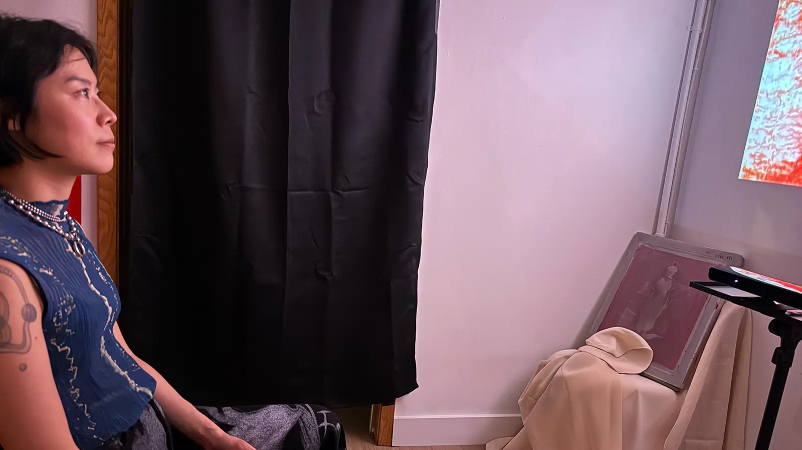

# Endymion

An interactive video installation in which a viewer's stillness shapes a projected image — and the image, in turn, shapes the viewer.



**First exhibited: 21 May 2026**  
**Webpage:** [reedobeirne.com/endymion-revisited](https://www.reedobeirne.com/endymion-revisited/)

---

## What it is

A single viewer enters a small, cave-like space and sits in a chair facing a projected film. The system watches them with a Kinect depth sensor. When the viewer is still, the image brightens slowly — moonlight descending. When they move, the image retreats into darkness and holds there before gradually recovering.

The piece is named after the Greek myth of Endymion: the sleeper on Mount Latmos who lies with open eyes while Selene, goddess of the Moon, descends each night to watch him. The encounter is structurally asymmetric — one figure watched, the other watching, across a divide that cannot be crossed. The sensor sees the viewer in ways the viewer cannot return: depth, velocity, silhouette. This asymmetry is part of the work.

Stillness is the input. The system rewards sustained attention, not gesture.

---

## Hardware

| Component | Role |
|---|---|
| Raspberry Pi 5 (8 GB) | Production runtime — runs the full stack at 23.976 fps |
| Kinect v1 (Xbox 360) | Depth sensor — background subtraction + foreground mask differencing |
| Nebula Mars 3 Air projector | 1080p display, 400 ANSI lumens |
| MacBook | Development, SSH access, log analysis |

---

## Software stack

- **Python 3.11** — main application
- **libfreenect / freenect** — Kinect v1 depth + IR data
- **OpenCV** — depth processing, foreground extraction
- **pygame** — video playback and display loop
- **NumPy** — frame-level image processing

---

## How it works

```
[Kinect depth sensor]
        │
        ▼
[KinectSensor] — background subtraction → foreground mask → frame-to-frame pixel diff
        │
        ▼
[PenaltyRoutine] — three-phase presence signal: FALLING → HOLDING → RISING
        │
        ▼
[Effects pipeline] — luminosity · vignette · desaturation applied to video frame
        │
        ▼
[pygame display] — 1920×1080 fullscreen at 23.976 fps
```

The sensor is a **velocity detector**, not a position detector. It measures how many foreground pixels changed state between consecutive frames. Slow movements (breathing, micro-shifts) produce little frame-to-frame change and go undetected. Fast movements (fidgeting, arm gestures, entry and exit) produce large change counts and trigger the penalty. This is intentional: the piece rewards body-level commitment to stillness.

The presence signal follows a three-phase routine:
- **FALLING** — motion detected; image snaps toward darkness using a fast time constant
- **HOLDING** — viewer becomes still, but holds at nadir for a fixed duration (the penalty is unconditional)
- **RISING** — slow climb back to full brightness over several seconds

---

## Running it

### Development mode (no hardware required)

```bash
git clone https://github.com/Great-Bucket/endymion-public.git
cd endymion-public
python3 -m venv venv && source venv/bin/activate
pip install -r requirements.txt
cp env.example .env
```

Run with the mock sensor (simulated sine-wave presence signal):
```bash
SENSOR_TYPE=mock FULLSCREEN=0 python main.py
```

Run with a webcam (frame differencing, no Kinect needed):
```bash
SENSOR_TYPE=camera FULLSCREEN=0 python main.py
```

The repo includes a 1-minute sample clip of the installation film. Set in `.env`:
```
VIDEO_PATH=assets/video/1min-slowFilm_10mbps_endymion-installation_h264.mp4
```

### On Raspberry Pi with Kinect

```bash
sudo apt install freenect libfreenect-dev
pip install freenect
SENSOR_TYPE=kinect FULLSCREEN=1 python main.py
```

See [`docs/operations/HANDOFF-pi-setup.md`](docs/operations/HANDOFF-pi-setup.md) for full Pi setup, SSH configuration, and calibration procedure.

---

## Key parameters (`.env`)

| Variable | Default | Effect |
|---|---|---|
| `SENSOR_TYPE` | `camera` | `mock` · `camera` · `kinect` |
| `VIDEO_PATH` | *(sample clip)* | Path to the video loop |
| `VIDEO_SPEED` | `1.0` | Playback speed multiplier (`0.5` = half speed) |
| `EFFECTS` | `luminosity` | Comma-separated: `luminosity,vignette,desaturation` |
| `KINECT_MASK_CHANGE_THRESHOLD` | `40000` | Motion sensitivity — calibrate on site |
| `HOLD_DURATION` | `2.4` | Seconds frozen at nadir after last motion |
| `RECOVERY_DURATION` | `8.0` | Seconds to climb back to full brightness |
| `EMPTY_CAVE_DARK` | `1` | `1` = dark when empty (production); `0` = bright when empty (legacy) |
| `DEBUG` | `0` | `1` = print sensor values to terminal |

---

## Documentation

The `docs/` folder contains the full engineering record of the project:

| Doc | What it covers |
|---|---|
| [`docs/reference/Project-Context.md`](docs/reference/Project-Context.md) | Conceptual framing, design principles, hardware inventory |
| [`docs/reference/DECISIONS.md`](docs/reference/DECISIONS.md) | Key architectural decisions and the reasoning behind them |
| [`docs/history/CALIBRATION-log.md`](docs/history/CALIBRATION-log.md) | Sensor algorithm iteration (v1 → v2 → v3), parameter search, key findings |
| [`docs/history/SOAK-TEST-REPORT-20260514.md`](docs/history/SOAK-TEST-REPORT-20260514.md) | 6-hour stability test, failure analysis, IR drift theory |
| [`docs/history/EXHIBITION-REPORT-20260521.md`](docs/history/EXHIBITION-REPORT-20260521.md) | First exhibition: what worked, what failed, lessons for next time |
| [`docs/operations/AT-VENUE.md`](docs/operations/AT-VENUE.md) | Step-by-step at-venue setup and calibration |
| [`docs/engineering/`](docs/engineering/) | Technical specs: presence signal, effects performance, monitoring, background drift recovery |

---

## License

**Code:** [CC BY-NC 4.0](https://creativecommons.org/licenses/by-nc/4.0/) — use and adapt with attribution, non-commercial only.  
**Video and images:** [CC BY-NC-ND 4.0](https://creativecommons.org/licenses/by-nc-nd/4.0/) — share with attribution, no modifications, non-commercial only.  
© Reed O'Beirne. See [LICENSE](LICENSE) for full terms.
